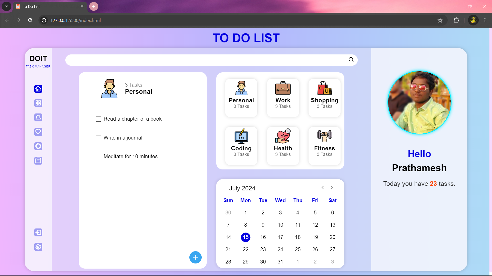
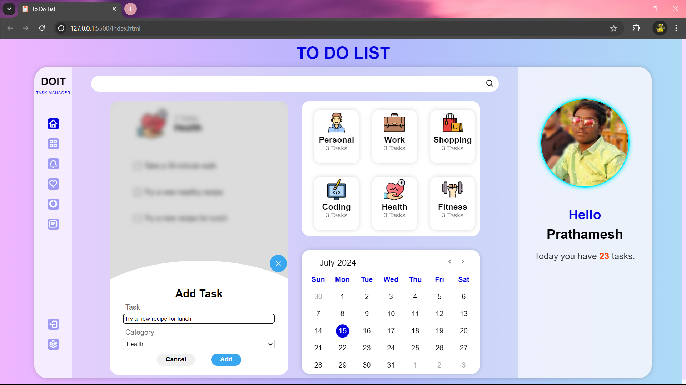
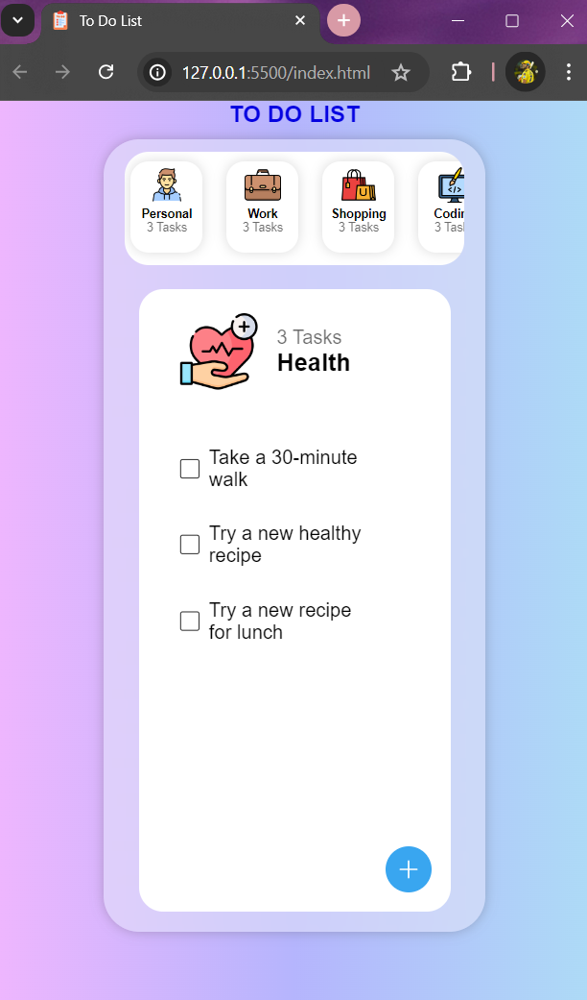

# To-Do List Web Application

## Overview
This project is a simple To-Do List web application built using HTML, CSS, and JavaScript. It allows users to manage tasks categorized into different categories such as Personal, Work, Shopping, Coding, Health, Fitness, Education, and Finance.

## Features
**Add and Remove Tasks:** Users can add new tasks with a specified category and mark them as completed or delete them.
**Category Management:** Tasks are organized by categories, and users can switch between different categories to view tasks specific to each category.
**Local Storage:** Tasks are saved to local storage, allowing users to persist their tasks across sessions.
**Responsive Design:** The application is responsive, ensuring a seamless user experience across devices

## Technologies Used
**HTML5:** Structure of the webpage.
**CSS3:** Styling and layout, using Flexbox for product layout and media queries for responsiveness.
**JavaScript:** Interactive functionality for the cart and menu.

## Demo
Check out the live demo of the project [here](https://prathameshchaughule.github.io/To-Do-List-Web-Development-/)

## Screenshots

## Contributing
Contributions are welcome! If you have suggestions for improvements or find any issues, please feel free to open an issue or submit a pull request.

## Contact
For any inquiries or feedback, please contact [Email](mailto:pvc14102002@gmail.com).
Enter
